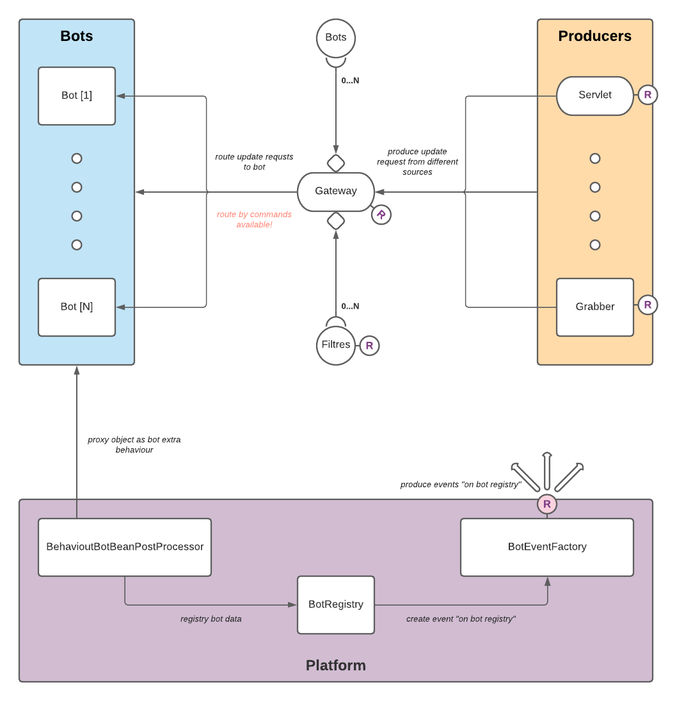

#  Telegram Bot Framework [](https://travis-ci.org/pengrad/java-telegram-bot-api) [](https://codecov.io/gh/pengrad/java-telegram-bot-api)

*Here should be english  readme file, but now its in progress*

*Read this in other languages: [Russian](README.ru.md)*

* [Обзор](#обзор)
* [Клиент](#клиент)
    - [Начало работы](#начало-работы)
	    - [Создание клиента](#создание-клиента)
	    - [Примеры вызовов](#примеры-вызовов)
    - [Развитие](#развитие)
* [Сервер](#сервер)
    - [Начало работы](#начало-работы)
	- [Фичи](#фичи)
	    - [Команды](#команды)
	    - [Маппинг параметров запроса](#маппинг-параметров-запроса)
	    - [Ответ на запрос](#ответ-на-запрос)
    - [Архитектура решения](#архитектура-решения)
	    - [Платформа](#платформа)
	    - [Продюсеры](#продюсеры)
	    - [Gateway](#маршрутизатор)
	- [Развитие](#развитие)
* [Лицензия](#лицензия)

# Обзор

Репозиторий содержит в себе набор  **java** библиотек, которые могут помочь вам в работе с [Telegram Bot API](https://core.telegram.org/bots/api),
сейчас они разделены на две основные части:
- Расширяемый интерфейс для отправки синхронных и асинхронных запросов к API или [TelegramHttpClient](telegram-bot-http-api/src/main/java/com/goodboy/telegram/bot/http/api/client/TelegramHttpClient.java);
- Интеграция со [Spring Boot](https://github.com/spring-projects/spring-boot).

Клиент не зависит от интеграции со Spring Boot - его можно использовать отдельно.

# Клиент

Gradle:
```groovy
// api
api 'com.github.ekgreen:telegram-bot-http-api:0.0.1-SNAPSHOT'
// ok http client implementation
implementation 'com.github.ekgreen:telegram-bot-ok-http-client:0.0.1-SNAPSHOT'
```
Maven:
```xml
<!-- api -->
<dependency>
  <groupId>com.github.ekgreen</groupId>
  <artifactId>telegram-bot-http-api</artifactId>
  <version>0.0.1-SNAPSHOT</version>
  <scope>provided</scope>
</dependency>
<!-- ok http client implementation -->
<dependency>
  <groupId>com.github.ekgreen</groupId>
  <artifactId>telegram-bot-ok-http-client</artifactId>
  <version>0.0.1-SNAPSHOT</version>
</dependency>
```

Клиент в первой своей итерации решает задачи не связанные с оборачиванием в фантик [Telegram Bot API](https://core.telegram.org/bots/api),
а нацелен на привнесение гибкости в процесс разработки. API [TelegramHttpClient](telegram-bot-http-api/src/main/java/com/goodboy/telegram/bot/http/api/client/BaseTelegramHttpClient.java)
расширяем по трем основным направлениям (вообще их пять, но два другие направления ближе к 'кишкам' реализации клиента, чем к повседневным настройкам):
* Вы можете использовать любой http клиент, если реализуете под него [HttpClientAdapter](telegram-bot-http-api/src/main/java/com/goodboy/telegram/bot/http/api/client/adapter/HttpClientAdapter.java).
В качестве дефолтной реализации в проекте есть имплементация интерфейса для [OkHttpClient](https://square.github.io/okhttp/), а именно 
[OkHttpClientAdapter](telegram-bot-ok-http-client/src/main/java/com/goodboy/telegram/bot/http/client/OkHttpClientAdapter.java);
* [Конфигурировать](telegram-bot-http-api/src/main/java/com/goodboy/telegram/bot/http/api/client/configuration/TelegramApiConfiguration.java) дополнительные настройки для клиента;
* Динамически или статически полученать токен/токены - за пользователем остается возможность выбрать способ получения токена или токенов в зависимости от конкретной ситуации.

## Начало работы
Все что нужно для начала работы с клиентом - это его создать :) Предусмотрено несколько дефолтных билдеров создание
которых не займет много времени.
### Создание клиента:
```java
// минимально возможная реализация в библиотеке с api клиента
final TelegramHttpClient client = TelegramHttpClientBuilder.defaultLesslessTelegramHttpClient(adapter);
// минимальная реализация с привязкой к конкретному боту
final TelegramHttpClient client = TelegramHttpClientBuilder.defaultTiedTelegramHttpClient(token,adapter);
// Данный билдер находится в библиотеке с расширением для OkHttpClient - билдер самодостаточный, ему не требуется 
// передавать на вход адаптер; используется дефолтный адаптер для данной имплементации
final TelegramHttpClient client = new OkHttpFilledTelegramHttpClientBuilder()
    .token(token)
    .build();
```

### Примеры
Получение информации о боте [[getMe]](https://core.telegram.org/bots/api#getme) используя сервисы API Telegram
```java
    @Test
    public void sendMessageWithApi() {
        // simple call
        final TelegramHttpClient client = new OkHttpFilledTelegramHttpClientBuilder()
                .token(getToken())
                .build();

        // create getMe service
        // use api is most simple way to call telegram bot api - api hides from user inner implementation
        // of telegram bot http client
        final var api = new TelegramMeImpl(client);

        // request to rich info about bot
        // all responses wraps in uniform telegram api response
        TelegramCoreResponse<User> response = api.getMe();

        // assert that it is success call
        Assertions.assertTrue(response.isOk());
        // my test bot name is 10words - here no logic
        Assertions.assertEquals("10words", response.getResult().getFirstName());
    }    
```
Получение информации о боте [[getMe]](https://core.telegram.org/bots/api#getme) используя телеграм клиент
```java
    @Test
    public void sendMessageWithClientTest() {
        // this example show some entrails of client implementation
        final TelegramHttpClient client = new OkHttpFilledTelegramHttpClientBuilder()
                .token(getToken())
                .build();


        // request to rich info about bot
        // all responses wraps in uniform telegram api response
        final TelegramCoreResponse<User> response = client.send(
                // method request is description of calling method with body and environment such as token
                // NOTE! that we already created client implementation tied to direct bot and it is not necessary
                // provide token on each call
                new MethodRequest<>(
                        // technical calling method description
                        // - calling telegram api name
                        // - type of calling api
                        // - expected returning type
                        new CallMethodImpl(TelegramMethodApiDefinition.GET_ME, RequestType.COMMAND, User.class)
                )
        );

        // assert that it is success call
        Assertions.assertTrue(response.isOk());
        // my test bot name is 10words - here no logic
        Assertions.assertEquals("10words", response.getResult().getFirstName());
    }
```
## Развитие

Развитие клиента предусматривается по двум направлениям:
* Оборачивание API в более user-friendly сервисы для минимизации пользовательского кода и повышения уровня 'комфорта' при работе с библиотекой;
* Имплементация всего Telegram API в базовых API сервисах, например как [TelegramMeApi](telegram-bot-api/src/main/java/com/goodboy/telegram/bot/api/methods/me/TelegramMeApi.java);
* Покрытие клиента unit-тестами;
* асинхронные запросы;
* Общий клиент для всего API (под вопросом).

# Сервер

Gradle:
```groovy
api 'com.github.ekgreen:spring-boot-hook-bot-starter:0.0.1-SNAPSHOT'
```
Maven:
```xml
<dependency>
  <groupId>com.github.ekgreen</groupId>
  <artifactId>spring-boot-hook-bot-starter</artifactId>
  <version>0.0.1-SNAPSHOT</version>
</dependency>
```

## Начало работы
Для начала работы достаточно подключить spring boot starter и написать пару аннотаций. Про архитектуру библиотеки будет чуть ниже, начнем с примеров
"Как быстро запустить собственного бота". Пример также можно посмотреть в репозитории [тут](telegram-bot-example/brownie/src/main/java/com/goodboy/telegram/bot/example/Brownie.java) 
и [тут](telegram-bot-example/brownie/src/main/java/com/goodboy/telegram/bot/example/ShowExampleBot.java).

Аннотация __@Bot__ - как контроллер, только для ботов; на самом деле над ней есть и аннотация контроллера: такой
подход позволяет инкапсулировать всю логику по работе с ботом внутри бота (ведь его потребности не заканчиваются на
обработке запросов от Telegram, также важно иметь возможность, например, администрировать бота. Сразу отмечу что
нужно не забывать - у сервлетов (DispatcherServlet и ServletTelegramUpdateApi) разные пути!
```java
@Bot(value = "example", path = "/example")
public class ShowExampleBot {
...
}
```
Для более определенного поведения бота (без подкапотной магии подстановки имен и урлов) советую явным образом 
определять значения __value__ и __path__ у аннотации __@Bot__, которые отвечают за имя бина и маппинг запросов соответственно.

Для того чтобы наш бот начал обрабатывать запросы потребуется объявить соответсвующий метод и пометить его аннотацией __@Webhook__
```java
@Webhook
public void someBodyCalledMe() {
    log.info("some body called me!");
}
```
Почти все! Нам остается рассказать нашему боту кто он есть, ведь как вы могли заметить мы еще нигде не связали бота 
с реальным ботом, который живет в Telegram.
```yaml
telegram:
  servlet:
    context-path: /telegram-bot
  example:
    token: ${test.token.value}
```
Здесь мы заполняем обязательны поля, а именно:
 * _telegram.servlet.context-path_ - уникальный uri сервлета, как вы помните мы оставили DispatcherServlet и данный uri
 нужен в первую очередь, чтобы разделить запросы между двумя сервлетами;
 * _telegram.{bot_name}.token_ - уникальный токен вашего бота (привязка к боту в Telegram).
 
## Фичи

### Команды
Как вы уже наверное знаете, используя API Telegram у вас есть два способа получить обновление: web-hook и long-polling. 
На самом деле, как вы дальше поймете для бота не важно откуда пришел update - важно что в web-hook вы установите ни два, 
ни пять URL-ов под каждый тип запроса, как мы уже привыкли в контроллерах, а один! А это значит что все запросы будут 
валиться в один метод без дополнительной логики по маршрутизации, а у нас она есть!

По умолчанию для ваших ботов работает маршрутизация по командам. Все что от вас требуется это добавить параметр в аннотацию 
__@Webhook__
 ```java
@Webhook(command = "salute")
public void saluteCommandExample() {
    log.info("some body called me with command [salute]!");
}
@Webhook(command = "show")
public void showCommandExample() {
    log.info("some body called me with command [show]!");
}
```
Но если вы захотите изменить логику маршрутизации, добавить новые атрибуты из запроса - это тоже [возможно](telegram-bot-spring/telegram-bot-spring-core/src/main/java/com/goodboy/telegram/bot/spring/api/gateway/GatewayRoutingResolver.java).

### Маппинг параметров запроса
До сих пор вы видели менты без входных аргументов, но это не то чего мы ждем. Мы хотим обрабатывать клиентские запросы и отвечать на них.
Данный раздел про обработку, а следующий про ответы.

В данный момент доступно 8 различных типов маппингов аргументов, но нет никаких ограничений сделать 100

| Type | Annotation | Description |
| :---: | :---: | ---|
| Update | --- | Основная сущность запроса. Стандартный формат запроса Telegram API |
| Integer | `@ChatId` | Идентификатор чата из которого пришло сообщение |
| String | `@MessageText` | Текст сообщения |
| String | `@Nickname` | Никнейм от кого пришел запрос|
| Message | --- | Сущность сообщения. Стандартный формат запроса Telegram API |
| Chat | --- | Сущность чата. Стандартный формат запроса Telegram API |
| UpdateContext | --- | Информация о боте и окружении для текущего запроса |

### Ответ на запрос
Обыденная логика бота это получить запрос и отправить ответ. Этот раздел про то как ответить на запрос

```java
@Bot(value = "example", path = "/example")
public class ShowExampleBot {
    
    private @Autiwired TelegramMessageApi api;

    // Отправить ответ самостаятельно используя наш telegram http клиент или любой другой
    @Webhook(command = "api-sender")
    public void useApiForAnswer(@ChatId Integer chatId) {
        api.sendMessage(new SendMessageApi()
                .setChatId(chatId)
                .setText(...)
    }

    // Вернуть в ответ боту один из многих методов API и бот сам отправит ответ
    @Webhook(command = "bot-sender")
    public Api useBotForAnswer(@ChatId Integer chatId) {
        return new SendMessageApi()
                .setChatId(chatId)
                .setText(...);
    }

}
```

## Архитектура решения


Вся архитектура фреймворка разделена на 4 части:
* Платформа [фиолетовый] - фактически интеграция Spring Framework и остальных частей Telegram Bot Framework;
* Продюсеры [персиковый] - все что может порождать [запросы](telegram-bot-api/src/main/java/com/goodboy/telegram/bot/api/Update.java)
 к ботам, например сервлет который принимает запросы от Telegram;
* Боты [голубой] - непосредственно отвечают за обработку запроса и бизнес-логику;
* Маршрутизатор [белый] - отвечает за маршрутизацию запросов по ботам, маршрутизация осуществляется по данным из окружения и запроса.

### Платформа
В платформу входят несколько компонент, основные отмечены на рисунке. __BotBehaviourBeanPostProcessor__ отвечает за поиск 
ботов. После того как бот найдена происходит два действия:
* регистрация бота в реестре;
* обертка бота дополнительной логикой - создается прокси, используя cglib; в дополнительную логику входят такие функции как
дополнение аргументов метода, заполнение контекстов запроса и тд

Регистрация бота в реестре осуществляется при помощи интерфейса __BotRegistryService__, помимо того что он сохраняет все данные
о ботах при регистрации сервис просит отбросить событие всем подписчикам о регистрации бота через __BotEventFactory__.

Как можно видеть на картинке, уже в начальной реализации проекта большое количество компонент подписано на событие регистрации
бота - они получают описание бота и дополняют свое состояние новыми данными.

### Продюсеры
На данный момент реализован один продюссер __ServletTelegramUpdateApi__ и второй __Grabber__ в разработке.

__ServletTelegramUpdateApi__ - это самая простая реализация сервлета, без фильтров, без сложных роутингов, без всего. 
Умеет работать только с POST запросами c телом запроса типа Update.

* Почему так сделано? - Потому что в текущей реализации проекта видится что никакого динамизна при вызове вебхуков через 
Telegram API нет. URL статический, авторизации и аутентификации нет и тд. При необходимости функционал будет расширен
* Почему не используется __DispatcherServlet__? - Потому что при реализации каждой отдельной задачи возникали все новые 
и новые проблемы, например, нужно замапить интерфейс в аргументы метода (UpdatingContext) - при запросе возникает 
рантайм ошибка: "...не удалось создать инстанс класса...", - надо подпирать. Нужно сделать марщрутизацию по командам - 
невозможно без черной магии и жертва приношения. Поэтому сервлет отвечает за маппинг бота по URI для всего отсального
есть __Gateway__.

__Grabber__ - будет использоваться для порождения запросов при помощи лонг полинга, то есть он будет загребать данные 
из Telegram сам.

### Gateway

Маршрутизатор отвечает за корректный вызов методов ботов (в терминологии фреймворка: хуки или вебхуки). Маршрутизация может
осуществляться по различным параметрам (это позволяет вреймворк), причем каждый бот может сам решать каким образом к нему 
маршрутизировать запросы. По умолчанию для всех реализован дефолтный роутер основанный на командах и взвешенном принятии 
решения. Пример:
```java
@Bot(value = "example", path = "/example")
public class ShowExampleBot {

    // 1. Для команды "show" наибольший приоритет
    // - можно заметить что есть второй метод с данной командой, но он имеет меньший приоритет 
    // так как в нем объявлено большее количество команд (более широкий метод)
    @Webhook(command = "show")
    public void mostShowCommandPriority(...) {
        ...
    }

    // 2. Для команды "salute" наибольший приоритет
    @Webhook(command = "salute")
    public void mostSaluteCommandPriority(...) {
        ...
    }

    // 3. Для команды "word" наибольший приоритет, для остальных есть более приоритетный метод
    @Webhook(command = {"show", "salute", "word"})
    public void mostWordCommandPriorityAndLessOther(...) {
        ...
    }

    // 4. В данный метод попадут все остальные запросы - дефолтный метод
    @Webhook
    public void defaultMethod(...) {
        ...
    }
}
```

## Развитие

На самом деле много идей для реализации, в ближайшем будущем сделаем __Grabber__ и также рассмотрим возможность произвольного
(пользовательского) генератора событий, например событие "напоминание о чем-то", докрутим возможность аутентификатции по 
атрибутам, например по nickname, через разные ресурсы - файл база и тд. Легковесное, тяжеловесное, динамическое исполнение
вебхуков. Многозадачность - gateway будет иметь вызывать (синхронно\асинхронно) все методы с равным весом\подходящие по параметрам. 

# Лицензия

The Spring Framework is released under version 2.0 of the [Apache License](https://www.apache.org/licenses/LICENSE-2.0).